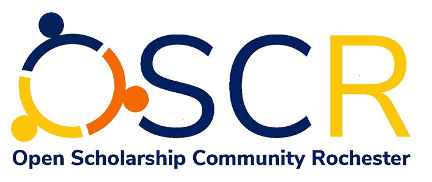

My research is related to Library and Information Science and has been focused mostly on Bibliometric projects lately.
Check my poster on [**Opening the Way: Transforming Scholarly Communications at the University of Rochester**](http://bit.ly/3pSmsM5).

I am currently on the Coordination Team of the [**Open Scholarship Community Rochester**](https://osc-rochester.org) (OSCR). OSCR is a local grass-roots initiative supporting the implementation of open science/scholarship practices in academia. It comprises faculty, graduate students, postdocs and support staff from higher education institutions in the Rochester region. The community's goal is to promote cultural and institutional change by bringing together and supporting people interested in open scholarship from all disciplines and at all levels of expertise. 
 {:width="300px"}.
